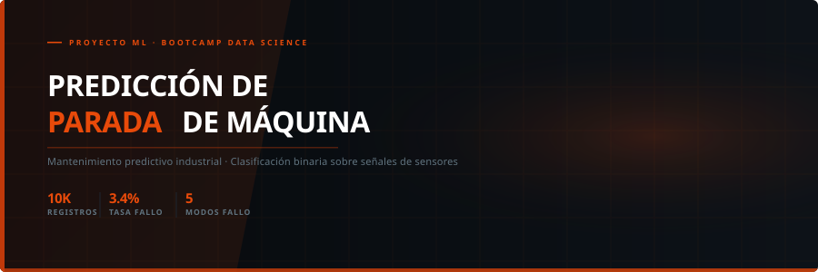
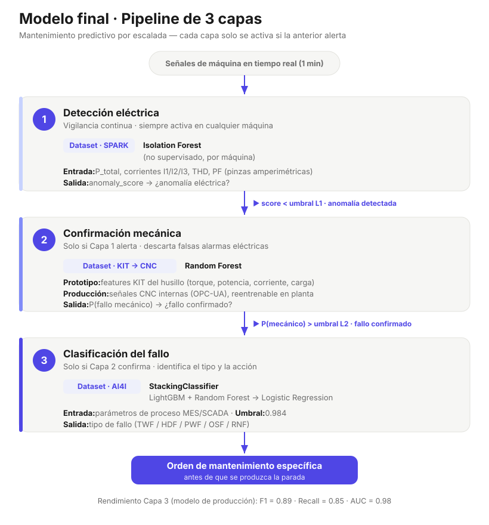

<p align="center">
  
</p>

# Predicción de Parada de Máquina — Proyecto ML

Sistema de **mantenimiento predictivo industrial** basado en Machine Learning,
desarrollado como proyecto final del Bootcamp de Data Science.

El sistema integra **tres datasets reales/industriales** en una **arquitectura de
escalada por capas** que replica cómo funcionan los sistemas de monitorización en
planta: detección eléctrica continua → confirmación mecánica → clasificación del
tipo de fallo y acción de mantenimiento.

---

## Objetivo

Detectar fallos inminentes en máquinas-herramienta antes de que ocurran, para reducir
las paradas no planificadas y su coste asociado (~3.000 €/fallo no detectado en una
pyme de criticidad media; ~300 €/alarma falsa).

**Modelo de producción (Capa 3):** `StackingClassifier` (LightGBM + Random Forest →
meta-modelo Logistic Regression), entrenado sobre AI4I 2020 con umbral de decisión
optimizado.

| Métrica (clase fallo, test n=2000) | Valor |
|---|---|
| Recall | **0.853** |
| Precision | 0.967 |
| F1-Score | 0.906 |
| ROC-AUC | 0.978 |
| Umbral de producción | 0.9858 |
| Falsos negativos | 10 / 68 fallos |
| Falsos positivos | 2 / 2000 |

> Fuente de verdad de estas cifras: [`models/model_config.yaml`](models/model_config.yaml).

**Impacto económico (Capa 3):** para una **pyme de 5 máquinas** con un gasto de
mantenimiento de referencia de **~1 M€/año** (coste por fallo no detectado ~3.000 €,
falsa alarma ~300 €), la Capa 3 evita ~81 % de ese coste → **≈ 0,83 M€/año** de ahorro.
(El ROI del modelo sobre su propio test escalado ×12 es ~2,08 M€/año, 85 %.)

> ⚠️ **Aviso metodológico.** Solo la **Capa 3** tiene métricas de test (n=2000), así que
> es la única cuyo ahorro en € es defendible. Los recalls de la Capa 1 (sin etiquetas) y
> la Capa 2 (LOO con n=18–33) **no son convertibles en € comparables** — convertirlos
> haría "ganar" a configuraciones inferiores por artefactos de muestra pequeña
> (p. ej. recall=1.0 con n=18 → 0 FN). Por eso las capas 1 y 2 se justifican por
> **cobertura y coste de instalación**, no por ahorro. Ver `notebooks/07_Sistema_Industrial.ipynb`
> (sección 7) y `06_04_Evaluacion_Final.ipynb`.

---

## Arquitectura del sistema

<p align="center">
  
</p>

```
CAPA 1 — Detección eléctrica          [siempre activa, 1 min]
    Isolation Forest sobre señales SPARK (potencia, corriente, THD, PF)
    → anomaly_score · cobertura 100 % del parque · sin etiquetas
         ↓ si score < umbral
CAPA 2 — Confirmación mecánica         [se activa si Capa 1 alerta]
    PROTOTIPO : Random Forest sobre features KIT (500 Hz, sensores externos)
    PRODUCCIÓN: Random Forest sobre señales internas CNC (OPC-UA/MTConnect, reentrenable)
    → P(fallo mecánico) · sin hardware adicional en planta
         ↓ si fallo confirmado
CAPA 3 — Clasificación de fallo        [se activa si Capa 2 confirma]
    StackingClassifier sobre parámetros de proceso AI4I (MES/SCADA)
    → tipo de fallo (TWF/HDF/PWF/OSF/RNF) + acción de mantenimiento
```

**Principios de diseño:**
- **Útil desde la Capa 1.** El sistema aporta valor aunque solo exista la capa eléctrica;
  cada capa añadida aumenta la confianza y el detalle del diagnóstico.
- **Degradación elegante.** Si un sensor o una fuente de datos falla, las demás capas
  siguen operando.
- **Capa 2 auto-mejorante.** Arranca con el baseline KIT, se sustituye en planta por el
  modelo CNC (cold-start con 18 experimentos) y se **reentrena de forma incremental** con
  datos reales hasta alcanzar una muestra suficiente para métricas fiables.

---

## Datasets

| Dataset | Fuente | Muestras | Rol | Descripción |
|---|---|---|---|---|
| **AI4I 2020** | UCI ML Repository | 10.000 | Capa 3 (producción) | Parámetros de proceso CNC. Objetivo: fallo binario + 5 tipos (TWF/HDF/PWF/OSF/RNF) |
| **CNC Mill** | Kaggle · [Tool Wear Detection](https://www.kaggle.com/datasets/shasun/tool-wear-detection-in-cnc-mill) | 18 experimentos | Capa 2 (producción/cold-start) | Señales internas de fresadora CNC. Seguimiento de desgaste de herramienta |
| **KIT Industrial** | FIZ Karlsruhe · DOI [10.35097/hvvwn1kfwf7qt48z](https://doi.org/10.35097/hvvwn1kfwf7qt48z) | 33 experimentos | Capa 2 (prototipo) | Series temporales a 500 Hz con etiquetas reales de anomalía. 5 tipos de fallo mecánico |
| **SPARK TEC** | FIZ Karlsruhe · DOI [10.35097/bjdg3m3rg5jv3skk](https://doi.org/10.35097/bjdg3m3rg5jv3skk) | 11 máquinas | Capa 1 | Señales eléctricas a 1 min (potencia, corriente, THD, PF). Monitorización no supervisada |

### Procedencia y reproducción de los datos

| Dataset | En `data/raw/` | Cómo regenerar |
|---|---|---|
| **AI4I 2020** | `raw/ai4i2020.csv` | Descargar de [UCI ML Repository](https://archive.ics.uci.edu/dataset/601/ai4i+2020+predictive+maintenance+dataset) |
| **CNC Mill** | `raw/cnc_extracted/` | Descargar de [Kaggle: CNC Mill Tool Wear](https://www.kaggle.com/datasets/shasun/tool-wear-detection-in-cnc-mill) y descomprimir |
| **KIT Industrial** | `raw/kit_extracted/` | Descargar de [FIZ Karlsruhe](https://doi.org/10.35097/hvvwn1kfwf7qt48z), descomprimir y copiar los `*_hfdata.csv` a `raw/kit_extracted/` |
| **SPARK TEC** | `raw/tec_extracted/` | Descargar de [FIZ Karlsruhe](https://doi.org/10.35097/bjdg3m3rg5jv3skk) y descomprimir los ZIP `TEC_*.zip` en `raw/tec_extracted/{MAQUINA}/{VAR}/` |

> Los directorios de descarga originales se eliminaron del repo tras la extracción para
> reducir peso. Los subconjuntos usados están íntegros en `raw/kit_extracted/` y
> `raw/tec_extracted/`. Los artefactos procesados (parquets SPARK, CSVs de features) se
> regeneran con los notebooks `02_*` o los scripts de `src/`.

---

## Estructura del proyecto

```
Milling-Machine-Failure-Prediction/
├── .streamlit/                    # Configuración de la app Streamlit
├── data/
│   ├── raw/                       # Datos originales (AI4I, CNC, KIT, SPARK)
│   └── processed/                 # CSVs procesados + scalers (los parquets se regeneran, no se versionan)
├── models/
│   ├── final_model.pkl            # Capa 3 — Stacking de producción (model + scaler + threshold)
│   ├── models.pkl                 # Capa 3 — bundle de modelos AI4I candidatos (intermedio)
│   ├── kit_model.pkl              # Capa 2 — RF prototipo (KIT, pipeline autocontenido)
│   ├── cnc_model.pkl              # Capa 2 — RF cold-start (CNC, reentrenable)
│   ├── spark_model.pkl /          # Capa 1 — Isolation Forest (SPARK)
│   │   spark_models.pkl
│   ├── spark_iforest_models.pkl   # Capa 1 — IF por máquina (intermedio)
│   └── model_config.yaml          # Especificación e hiperparámetros del modelo de producción
├── notebooks/
│   ├── 01_EDA/                    # Análisis exploratorio por dataset
│   ├── 02_PREPROCESADO/           # Feature engineering por dataset
│   ├── 03_MODELOS INICIALES/      # Modelos base y comparativa
│   ├── 04_EVALUACION_MODELOS/     # Evaluación formal + impacto económico
│   ├── 05_MODELOS_AFINADOS/       # Optuna, Stacking, dos etapas, no supervisado, tool-tracking
│   ├── 06_MODELOS_FINALES/        # Modelos finales por capa + evaluación integrada
│   └── 07_Sistema_Industrial.ipynb # Pipeline de escalada por capas + dashboard
├── src/
│   ├── app.py                     # App Streamlit (demo interactiva)
│   ├── paths.py                   # Rutas del proyecto (RAW/PROCESSED/MODELS/REPORTS)
│   ├── utils.py                   # Constantes AI4I, carga, splits, eval_threshold
│   ├── kit.py / spark.py          # Carga y features de KIT y SPARK (fuente única de verdad)
│   ├── data_processing.py         # Pipeline de preprocesado → data/processed/
│   ├── training.py                # Entrena y guarda el Stacking de producción
│   └── evaluation.py              # Informe de evaluación sobre test
├── reports/                       # Memoria, presentaciones y planteamiento
│   ├── memoria.ipynb              # Memoria del proyecto
│   ├── presentacion_proyecto.html
│   ├── planteamiento_inicial.html / .md
│   └── img/                       # Imágenes de las presentaciones
├── img/                           # Imágenes del README y diagramas
├── requirements.txt               # Dependencias del proyecto
└── README.md
```

---

## Notebooks — guía de lectura

El proyecto está organizado por **fases** (carpetas `01`→`07`) y, dentro de cada fase,
por **dataset** (`_01` AI4I, `_02` CNC, `_03` KIT/Industrial, `_04` SPARK).

### Por dataset

| Fase | AI4I (Capa 3) | CNC (Capa 2 prod.) | KIT (Capa 2 prototipo) | SPARK (Capa 1) |
|---|---|---|---|---|
| **01 · EDA** | `01_01_EDA_AI4I` | `01_02_EDA_CNC` | `01_03_EDA_Industrial` | `01_04_EDA_SPARK` |
| **02 · Preprocesado** | `02_01_Preprocesado_AI4I` | `02_02_Preprocesado_CNC` | `02_03_Preprocesado_Industrial` | `02_04_Preprocesado_SPARK` |
| **03 · Modelos iniciales** | `03_01_Modelos_AI4I` | `03_02_Modelos_CNC` | `03_03_Modelos_Industrial` | `03_04_Modelos_SPARK` |
| **04 · Evaluación** | `04_01_Evaluación_modelos_AI4I` | `04_02_Evaluación_CNC` | `04_03_Evaluación_Industrial` | `04_04_Evaluación_SPARK` |

### 05 · Modelos afinados (AI4I y resto)

| Notebook | Contenido |
|---|---|
| `05_01_1_LightGBM_AI4I` | Optuna + LightGBM afinado |
| `05_01_2_RF_AI4I` | Optuna + Random Forest afinado |
| `05_01_3_SVM_AI4I` | Optuna + SVM afinado |
| `05_01_4_Stacking_AI4I` | Stacking LGBM + RF (base del modelo de producción) |
| `05_01_5_No_Supervisado_AI4I` | PCA, t-SNE, clustering, Isolation Forest |
| `05_01_6_Dos_Etapas_AI4I` | Pipeline especializado por tipo de fallo |
| `05_01_7_Tool_Tracking_AI4I` | **Capa 2 producción**: seguimiento de desgaste con señales CNC internas; modelo reentrenable → `cnc_model.pkl` |
| `05_02_Modelos_CNC` | Modelado del dataset CNC Mill |
| `05_03_Modelos_Industrial` | Búsqueda de hiperparámetros KIT (RF/GB/SVM con LOO-CV) → `kit_model.pkl` |
| `05_04_Modelos_SPARK` | Optimización del Isolation Forest (contamination, n_estimators), comparativa OCSVM/LOF → `spark_model.pkl` |

### 06 · Modelos finales por capa

| Notebook | Contenido |
|---|---|
| `06_01_Modelo_Final_Capa1_SPARK` | Isolation Forest definitivo de Capa 1 |
| `06_02_Modelo_Final_Capa2_Mecanica` | Modelo mecánico definitivo (KIT → CNC) |
| `06_03_Modelo_Final_Capa3_AI4I` | Stacking de producción → `final_model.pkl` + `model_config.yaml` |
| `06_04_Evaluacion_Final` | Evaluación integrada de las 3 capas, roles y fiabilidad por capa, economía defendible |

### 07 · Integración

| Notebook | Contenido |
|---|---|
| `07_Sistema_Industrial` | `EscalationPipeline` (Capa 1→2→3), 4 escenarios industriales, dashboard de operario y análisis de cobertura/coste |

---

## Instalación y uso

```bash
# 1. Instalar dependencias (Python 3.12)
pip install -r requirements.txt

# 2. App de demo interactiva (desde la raíz del proyecto)
python -m streamlit run src/app.py

# 3. (Opcional) Regenerar artefactos desde cero
python src/data_processing.py   # data/processed/
python src/training.py          # models/final_model.pkl + model_config.yaml
python src/evaluation.py         # informe de evaluación sobre test
```

Los notebooks asumen que `src/` está en el path; cada uno hace
`import sys; sys.path.insert(0, '../src')` (o `'../../src'` según su profundidad) y carga
rutas desde [`src/paths.py`](src/paths.py), de modo que funcionan sin importar desde dónde
se ejecuten.

---

## Tecnologías

`Python 3.12` · `scikit-learn` · `LightGBM` · `XGBoost` · `Optuna` · `SHAP`
`pandas` · `numpy` · `scipy` · `matplotlib` · `seaborn` · `Streamlit` · `pyarrow`
